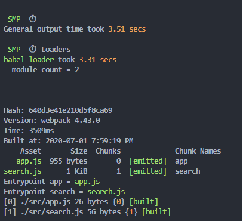

## 速度分析插件
分析整个打包总耗时
每个插件和loader的耗时情况

## 使用speed-measure-webpack-plugin
> npm i speed-measure-webpack-plugin -D

```js
const speedMeasureWebpackPlugin = require('speed-measure-webpack-plugin')

const smp = new speedMeasureWebpackPlugin();

module.exports = smp.wrap({
  entry: {
    app: './src/app.js',
    search: './src/search.js',
  },
  output: {
    filename: '[name].js',  // 通过占位符确保文件命名的唯一  app和search
    path: __dirname + '/dist'
  },
  module: {
    rules: [
      {test: /.js$/, use: 'babel-loader'}
    ]
  },
  mode: 'production',
})
```
### 各插件构建时间
仅构建babel-loader花费了3.31s
