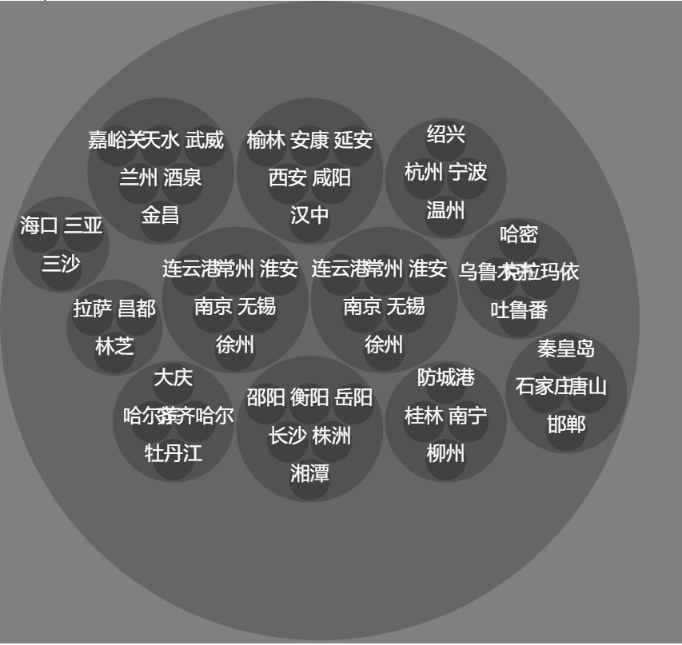

## 知识点d3库的 hierarchy 对数据进行规范化

```js
import React, { Component } from 'react';
import * as d3 from 'd3';

const TAU = 2 * Math.PI;

export default class Canvas extends Component {
  componentDidMount() {
    const context = this.canvas.getContext('2d');
    const dataSource = 'https://s5.ssl.qhres.com/static/b0695e2dd30daa64.json';
    this.drawDataAnalyse(context, dataSource)
  }

  drawDataAnalyse = (context, dataSource) => {
    fetch(dataSource).then(res => res.json()).then(data => {
      const regions = d3.hierarchy(data).sum(d => 1).sort((a, b) => b.value - a.value);
      const pack = d3.pack().size([800, 800]).padding(3);
      const root = pack(regions);
      this.draw(context, root)
    });
  }

  draw = (ctx, node, {fillStyle = 'rgba(0, 0, 0, 0.2)', textColor = 'white'} = {}) => {
    const children = node.children;
    const {x, y, r} = node;
    ctx.fillStyle = fillStyle;
    ctx.beginPath();
    ctx.arc(x, y, r, 0, TAU);
    ctx.fill();
    if(children) {
      for(let i = 0; i < children.length; i++) {
        this.draw(ctx, children[i]);
      }
    } else {
      const name = node.data.name;
      ctx.fillStyle = textColor;
      ctx.font = '1.5rem Arial';
      ctx.textAlign = 'center';
      ctx.fillText(name, x, y);
    }
  }

  render() {
    return (
      <div style={{ backgroundColor: 'grey' }}>
        <canvas ref={node => this.canvas = node} width="800" height="800"></canvas>
      </div>
    )
  }
}
```

