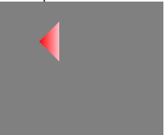

```js
import React, { Component } from 'react';

export default class Canvas extends Component {
  componentDidMount() {
    this.draw(50, 50, 75, 25, 75, 75, 'red', 'pink', 'fill' )
  }

  // stroke,fill
  draw(x1, y1, x2, y2, x3, y3, color1, color2, type) {
    const context = this.canvas.getContext('2d');

    context.beginPath();
    context.moveTo(x1, y1);
    context.lineTo(x2, y2);
    context.lineTo(x3, y3);
    // const grad=context.createRadialGradient(x1,y1,10,x1,y1,35)
    const grad=context.createLinearGradient(x1, y1, x2, y1)
    grad.addColorStop(0,color1);                  //定义渐变色颜色
    grad.addColorStop(1,color2);
    context[type + 'Style'] = grad;
    context.closePath();
    context[type]();
  }

  render() {
    return (
      <div style={{ backgroundColor: 'grey' }}>
        <canvas ref={node => this.canvas = node} width="800" height="800"></canvas>
      </div>
    )
  }
}
```

