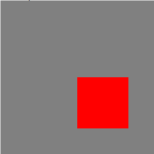

## 位置问题
```js
import React, { Component } from 'react';

export default class Canvas extends Component {
  componentDidMount() {
    const context = this.canvas.getContext('2d');
    const rectSize = [100, 100];
    context.fillStyle = 'red';
    context.beginPath()
    context.rect(0.5 * this.canvas.width, 0.5 * this.canvas.height, ...rectSize)
    context.fill()
  }

  render() {
    return (
      <div style={{ width: '300px', height: '300px', backgroundColor: 'grey' }}>
        <canvas ref={node => this.canvas = node} width="300" height="300"></canvas>
      </div>
    )
  }
}
```


### 如何使红色方块居中？
1. 画图时计算矩形的起始位置
2. translate => 移动画布再绘制，绘制完成恢复
```js
// 平移
context.translate(-0.5 * rectSize[0], -0.5 * rectSize[1])
...执行绘制
// 恢复
context.translate(0.5 * rectSize[0], 0.5 * rectSize[1])
```

3. save和restore
```js
context.save();
context.translate(-0.5 * rectSize[0], -0.5 * rectSize[1])
...执行绘制
context.restore();
```

### 实例
```js
import React, { Component } from 'react';

export default class Canvas extends Component {
  componentDidMount() {
    const context = this.canvas.getContext('2d');
    const rectSize = [100, 100];
    context.fillStyle = 'red';
    context.save();
    context.translate(-0.5 * rectSize[0], -0.5 * rectSize[1])
    context.beginPath()
    context.rect(0.5 * this.canvas.width, 0.5 * this.canvas.height, ...rectSize)
    context.fill()
    context.restore()
  }

  render() {
    return (
      <div style={{ width: '300px', height: '300px', backgroundColor: 'grey' }}>
        <canvas ref={node => this.canvas = node} width="300" height="300"></canvas>
      </div>
    )
  }
}
```