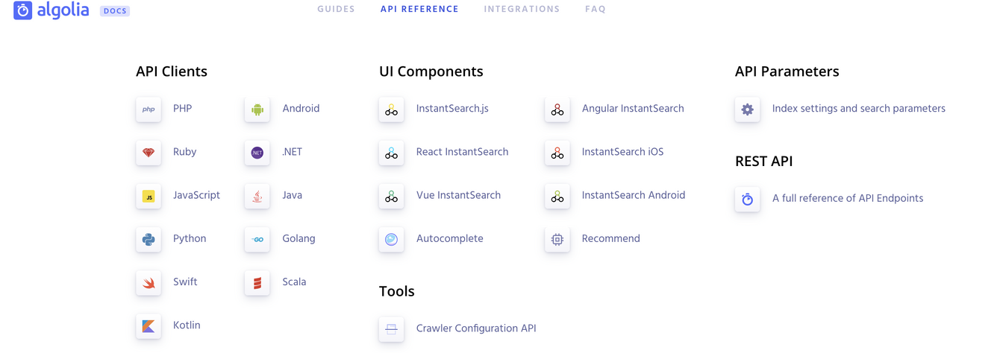
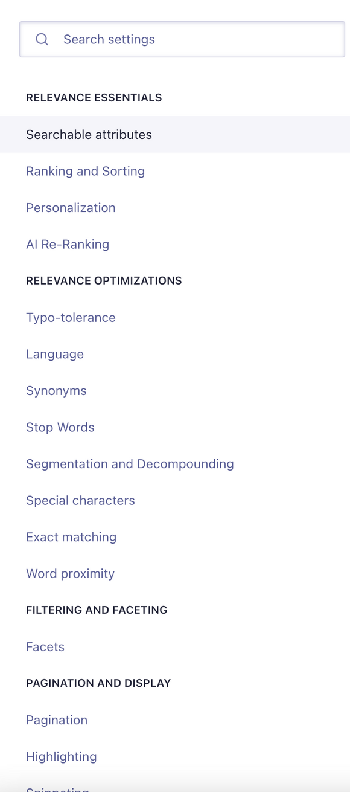

# React 项目集成搜索功能

最近在一个To C的项目中赶工，是有关一个互联网软件产品旧官网的改造项目。

官网页作为软件产品的门户页，有着很好的引流纳新作用；提到官网页，首先大家能想到的是页面的SEO能力，然后是多端适配性，还有大量酷炫的动画效果等等。然鹅，还有一个可能被大家忽略的基础功能，搜索。

因为SEO的要求，使用React技术栈的我们，网页要么使用SSR技术，要么使用SSG技术。考虑到项目后期的维护和运营，以及开发的难易程度，最终项目使用[GatsbyJs](https://www.gatsbyjs.com/)架构对老项目进行改造和迁移，使用CMS工具生产页面数据，因为页面数据都是CMS上配置的，几乎没有后端开发成本。

搜索功能在我原来的意识里，是ES或者Solr等比较重的搜索框架。在这个几乎纯前端的项目里它应该怎么做呢？我原以为这是一个巨大且复杂的工作，直到我遇到了[algolia](https://www.algolia.com/)，它让我觉得原来搜索也可以这么简单，如果你的项目有搜索相关的需求，不要犹豫，可以考虑它！

algolia的集成非常简单，而且，不分前后端，不分技术平台，你总能找到一种集成方式



对于前端项目来讲，官方提供两种集成方式

1.第一种，也是官方推荐的方式，称之为，UI部件集成（UI Components）。这种方式需要引入  react-instantsearch-dom；通过UI部件集成可以获得，用户在输入过程中，组件自动向algolia服务器请求搜索的数据，也就是即时搜索的体验。

```js
// Import components
import {
  InstantSearch,
  Hits,
  SearchBox,
} from 'react-instantsearch-dom';

// Create the App component
class App extends Component {
  render() {
    return (
      <div className="ais-InstantSearch">
        <h1>React InstantSearch e-commerce demo</h1>
        <InstantSearch indexName="demo_ecommerce" searchClient={searchClient}>
          <div className="right-panel">
            <SearchBox />
            <Hits hitComponent={Hit} />
          </div>
        </InstantSearch>
      </div>
    );
  }
}
```

上面是官网最简demo,要想使它运行起来，还需要做好数据初始化的工作。也就是searchClient的建立。

```js
// For the search only version
import algoliasearch from 'algoliasearch/lite';
//建立searchClient
const client = algoliasearch('TOVK437VU9', 'f936c4135e7356c9f968b54c61d62144');
// 初始化索引分片
const index = client.initIndex('your_index_name');
```

上面代码中的client就是我们和algolia建立认证的本地client。client.initIndex 方法帮助我们初始化了索引分区；说到这里，得稍微解释一下了。索引分区，是algolia进行数据分组的名称，换句话说，用户上传到algolia的数据，必须要放在某个或者某些索引分区内。我们如果不好理解，可以把它类比为关系型数据库的一个表。每一个client就是连接到了一个“数据库”。

建立好了索引分组后，便可以上传可供用户搜索的数据了，官方支持两种上传搜索数据方式，第一种是用户自行上传数据，可以通过手动上传或者工具上传；


第二种是，用户在algolia控制台添加爬虫工具，并配置好爬虫工具。爬虫更新索引周期为24h,也就是说，对于页面数据不变化的网站，可以考虑使用这个工具，否则需要容忍当天更新的内容，第二天才能被用户搜索到。爬虫工具属于付费功能，需要在爬虫工具面板进行配置，可参考[这里](https://www.algolia.com/doc/tools/crawler/getting-started/quick-start/)。

1. 第二种集成方式，使用官方sdk进行集成(API Clients)。sdk中提供了各种api供用户调用，涉及创建索引，设置索引配置，上传，更新，查询索引数据等等，比较好用。

感受一下algolia的api使用方式

```js
const client = algoliasearch('TOVK437VU9', 'f936c4135e7356c9f968b54c61d62144');
const index = client.initIndex('indexName');

// only query string
index.search('query string').then(({ hits }) => {
  console.log(hits);
});

// with params
index.search('query string', {
  attributesToRetrieve: ['firstname', 'lastname'],
  hitsPerPage: 50,
}).then(({ hits }) => {
  console.log(hits);
});
```

是不是异常简单，好用到爆？

algolia的配置也很丰富。所有的配置可以在索引的控制面板中进行设置。如下图，


当然也可以使用Api进行设置

```js
index.setSettings({'customRanking': ['desc(followers)']}).then(() => {
  // done
});
```

更多设置请参考[这里](https://www.algolia.com/doc/api-reference/settings-api-parameters/)。

以上就是快速集成的一些方式了（不包括爬虫工具），再者就是我要检讨一下，可能我有点误导你们，虽然看着集成algolia很轻松，但是集成后那么多的Api 参数以及配置，这些参数和配置代表的意义可包含的太多了，每一个参数都需要一篇文档进行解释，因此这些熟悉和灵活调整Api参数才是使用algolia的难点。


本文也只是为algolia入门做一个宣传，入门，抛砖引玉，希望看官莫喷。