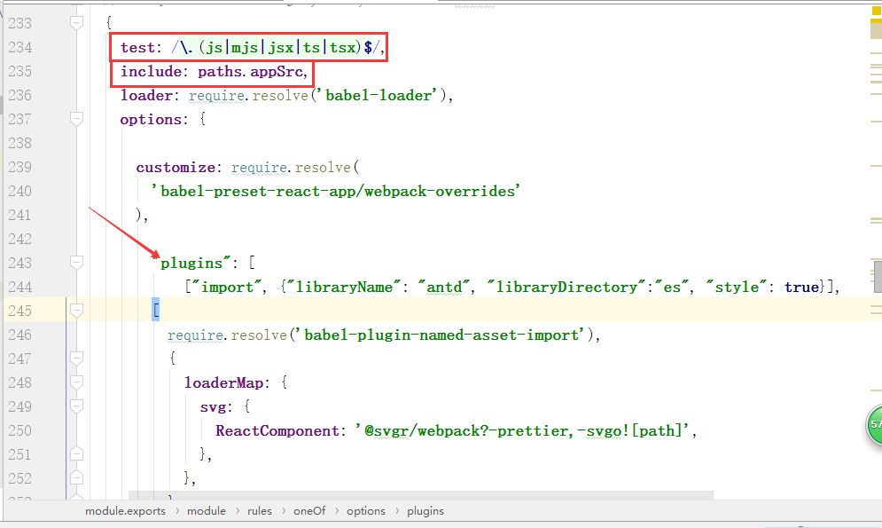

```js
// webpack.config.js
const lessToJS = require('less-vars-to-js');

const themVariables = lessToJS(
  fs.readFileSync(path.resolve(__dirname, './theme.less'), 'utf8'))
)

module.exports = {
  rules: [{
    test: /\.less$/,
    use: [{
      loader: 'style-loader',
    }, {
      loader: 'css-loader', // translates CSS into CommonJS
    }, {
      loader: 'less-loader', // compiles Less to CSS
+     options: {
+       lessOptions: { // 如果使用less-loader@5，请移除 lessOptions 这一级直接配置选项。
// +         modifyVars: {
// +           'primary-color': '#1DA57A',
// +           'link-color': '#1DA57A',
// +           'border-radius-base': '2px',
// +         },
          modifyVars: themVariables,
+         javascriptEnabled: true,
+       },
+     },
    }],
    // ...other rules
  }],
  // ...other config
}
```