# babel编译流程
三步： 
  1. parse：通过 parser 把源码转成抽象语法树（AST）
   
  2. transform：遍历 AST，调用各种 transform 插件对 AST 进行增删改
   
  3. generate：把转换后的 AST 打印成目标代码，并生成 sourcemap

## parse
`let name = 'lu'`

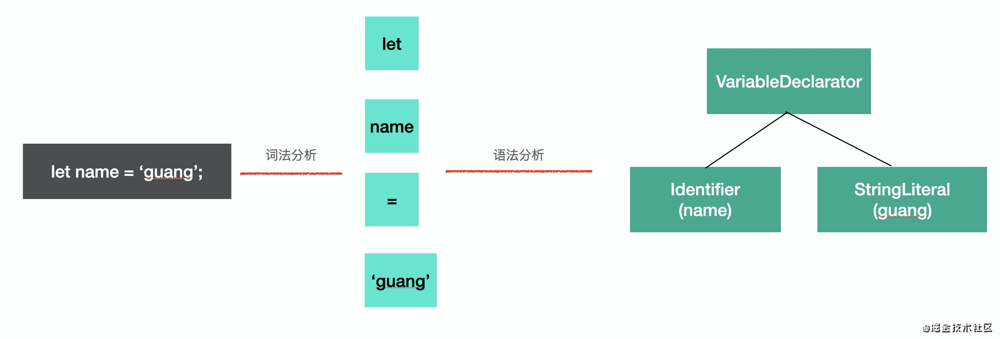

## transform
对parse的AST进行处理，会进行 AST 的`遍历`，遍历的过程中处理到不同的 AST 节点会调用注册的相应的 `visitor 函数`，visitor 函数里可以对 AST 节点进行`增删改`，返回`新的 AST`（可以指定是否继续遍历新生成的 AST）。这样遍历完一遍 AST 之后就完成了对代码的修改。
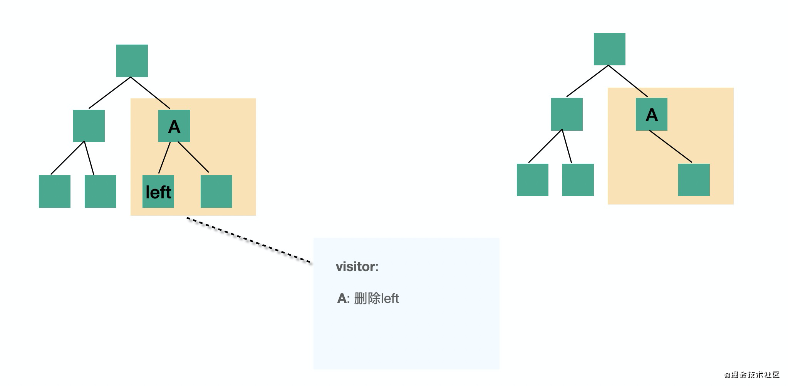

## generate
generate 阶段会把 AST 打印成目标代码字符串，并且会生成 sourcemap。不同的 AST 对应的不同结构的字符串。比如 `IfStatement` 就可以打印成 `if(test) {}` 格式的代码。这样从 AST 根节点进行递归打印，就可以生成目标代码的字符串。

# babel的常用AST节点

## Literal 字面量
Literal 是字面量的意思，比如 let name = 'jiang'中，'guang'就是一个字符串字面量 StringLiteral，相应的还有数字字面量 NumericLiteral，布尔字面量 BooleanLiteral，字符串字面量 StringLiteral，正则表达式字面量 RegExpLiteral 等
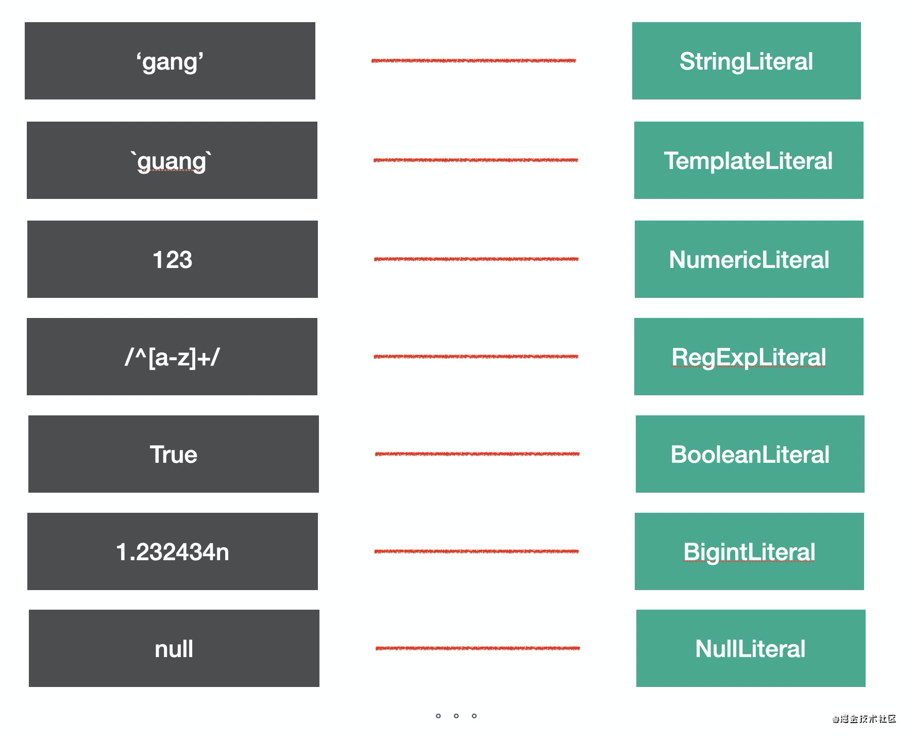

## Identifier 标识符
Identifier 是变量和变量的引用，代码中也是随处可见
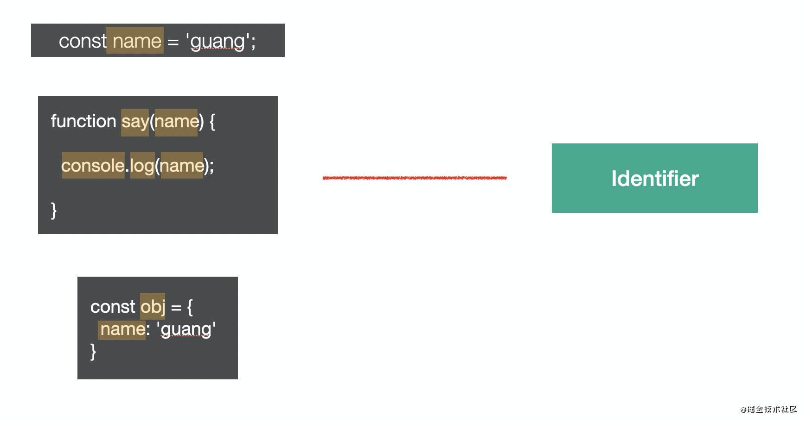

## Statement 语句
`语句`是代码执行的`最小单位`，可以说，代码是由语句（Statement）构成的。

break;  
continue;  
return;  
debugger;  
throw Error();  
{}  
try {} catch(e) {} finally{}  
for (let key in obj) {}  
for (let i = 0;i < 10;i ++) {}  
while (true) {}  
do {} while (true)  
switch (v){case 1: break;default:;}  
label: console.log();  
with (a){}  
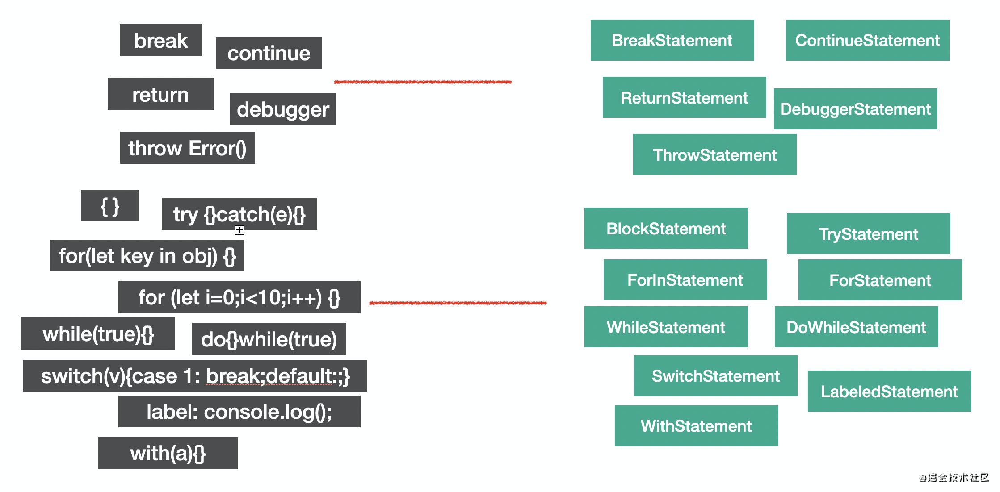

## Declaration 声明语句
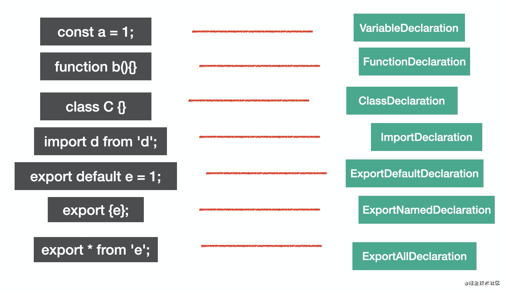

## Expression 表达式
`identifier`、`super` 有返回值(表达式的特点)，符合表达式的特点，所以也是 `expression`

有的表达式可以单独执行，符合语句的特点，所以也是语句，比如赋值表达式、数组表达式等，但有的表达式不能单独执行，需要和其他类型的节点组合在一起构成语句。比如匿名函数表达式和匿名 class 表达式单独执行会报错

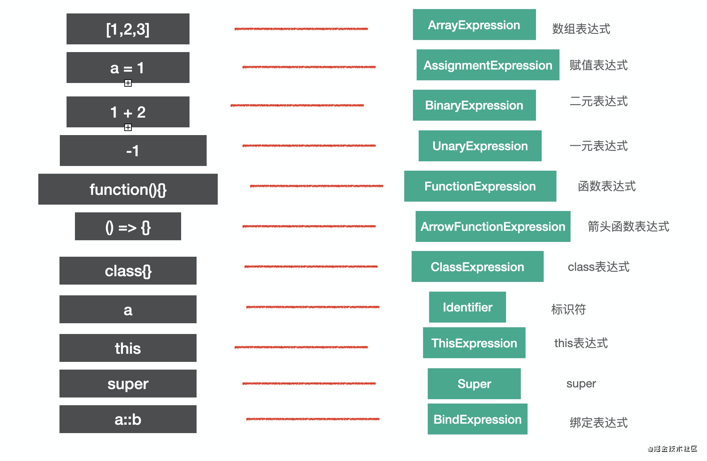

```js
a = function() {}
b = class{}

// 表达式语句解析成 AST 的时候会包裹一层 ExpressionStatement 节点，代表这个表达式是被当成语句执行的

// 表达式的特点是有返回值，有的表达式可以独立作为语句执行，会包裹一层
```
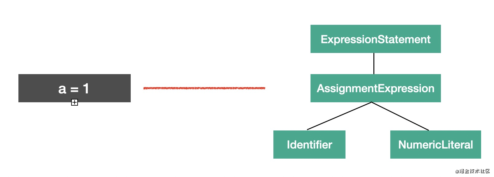

## Class
class 的语法比较特殊，有专门的 AST 节点来表示。

整个 class 的内容是 ClassBody，属性是 ClassProperty，方法是ClassMethod（通过 `kind` 属性来区分是 `constructor` 还是 `method`）。

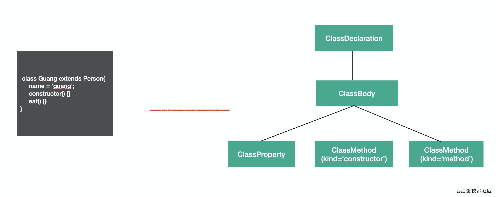

## Modules
es module 是语法级别的模块规范，所以也有专门的 AST 节点。

## import

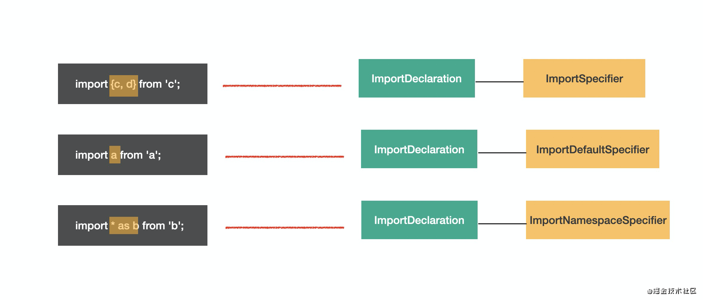
图中黄框标出的是 `specifier` 部分。可以直观的看出整体结构相同，只是specifier 部分不同，所以 import 语法的 AST 的结构是ImportDeclaration 包含着各种 `import specifier`。

## export
```js
export { b, d};
export default a;
export * from 'c';
```
对应的 AST 节点为: 只有`ExportNamedDeclaration`才有`ExportSpecifier`

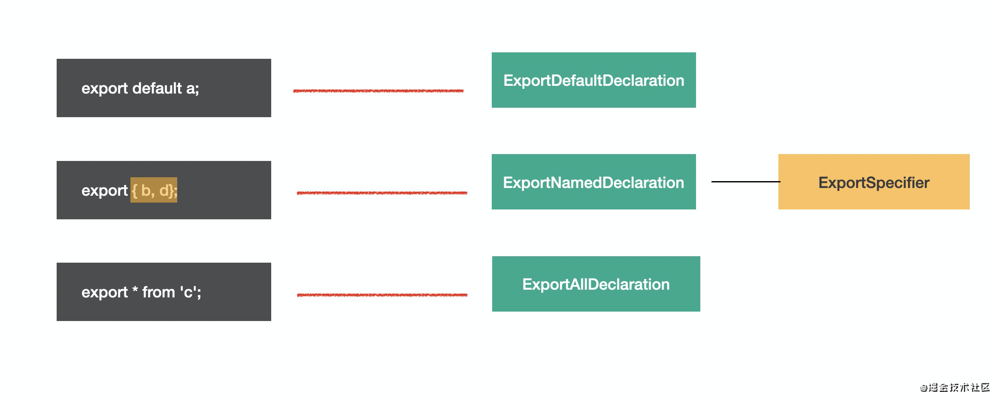

## Program & Directive
program 是代表整个程序的节点(root)。它有 body 属性代表程序体，存放 statement 数组，就是具体执行的语句的集合。还有 directives 属性，存放Directive 节点，比如`"use strict"` 这种指令会使用 Directive 节点表示。

Program 是包裹具体执行语句的节点，而 Directive 则是代码中的指令部分

## File & Comment
babel 的 AST 最外层节点是 File，它有 program、comments、tokens 等属性，分别存放 Program 程序体、注释、token 等，是最外层节点。

注释分为块注释和行内注释，对应 CommentBlock (/* */) 和 CommentLine ( // ) 节点。

# AST 可视化查看工具
网站查看语句对应的AST  
https://astexplorer.net/

babel parser 仓库里的 AST 文档  
https://github.com/babel/babel/blob/main/packages/babel-parser/ast/spec.md

@babel/types 的 typescript 类型定义。  
https://github.com/babel/babel/blob/main/packages/babel-types/src/ast-types/generated/index.ts

# AST 的公共属性
每种 AST 都有自己的属性，但是它们也有一些公共属性：

- `type`： AST 节点的类型
- `start、end、loc`：start 和 end 代表该节点对应的源码字符串的开始和结束下标，不区分行列。而 loc 属性是一个对象，有 line 和 column 属性分别记录开始和结束行列号。
- `leadingComments、innerComments、trailingComments`： 表示开始的注释、中间的注释、结尾的注释，因为每个 AST 节点中都可能存在注释，而且可能在开始、中间、结束这三种位置，通过这三个属性来记录和 Comment 的关联。
- `extra`：记录一些额外的信息，用于处理一些特殊情况。