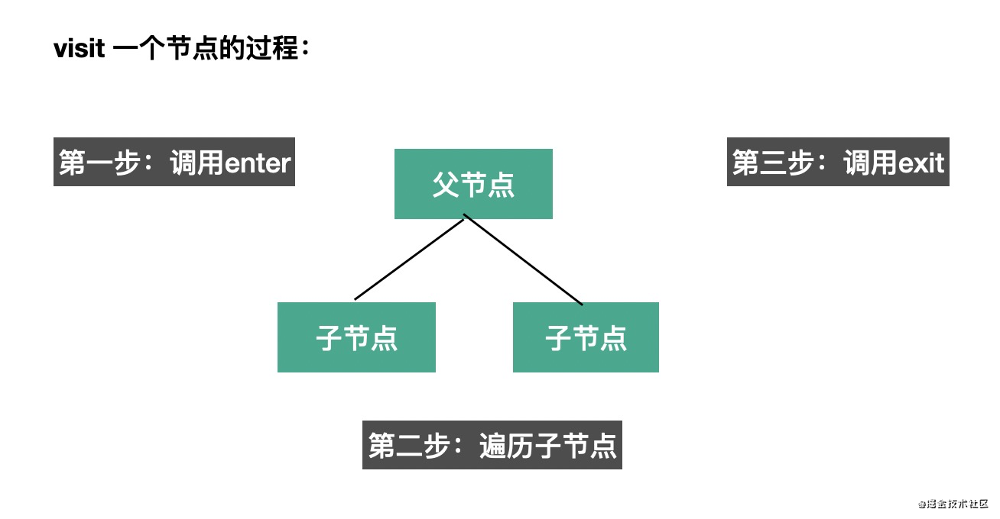
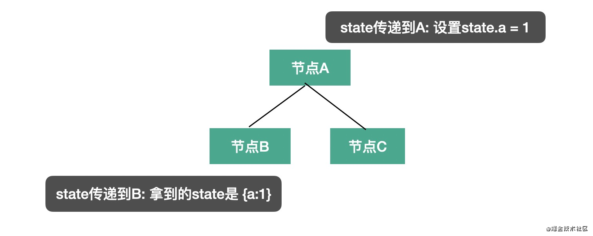

我们知道 babel 的编译流程分为三步：parse、transform、generate，每一步都暴露了一些 api 出来。

- parse 阶段有`@babel/parser`，功能是把源码转成 AST
- transform 阶段有 `@babel/traverse`，可以遍历 AST，并调用 visitor 函数修改 AST，修改 AST 自然涉及到 AST 的判断、创建、修改等，这时候就需要 `@babel/types` 了，当需要批量创建 AST 的时候可以使用 `@babel/template` 来简化 AST 创建逻辑。
- generate 阶段会把 AST 打印为目标代码字符串，同时生成 sourcemap，需要 `@babel/generate` 包
- 中途遇到错误想打印代码位置的时候，使用 `@babel/code-frame` 包
- babel 的整体功能通过`@babel/core` 提供，基于上面的包完成 babel 整体的编译流程，并实现插件功能。
- 
学习 `@babel/parser`，`@babel/traverse`，`@babel/generate`，`@babel/types`，`@babel/template` 这五个包的 api 的使用。

## @babel/parser
babel parser 叫 babylon，是基于 acorn 实现的，扩展了很多语法，可以支持 es next（现在支持到 es2020）、jsx、flow、typescript 等语法的解析，其中 jsx、flow、typescript 这些非标准的语法的解析需要指定语法插件

```ts
//  parse 返回的 AST 根节点是 File（整个 AST）
function parse(input: string, options?: ParserOptions): File

// 返回的 AST 根节点是是 Expression（表达式的 AST）
function parseExpression(input: string, options?: ParserOptions): Expression

```

具体的options：  
https://babeljs.io/docs/en/babel-parser#options  
其实主要分为两类，一是 parse 的内容是什么，二是以什么方式去 parse
- parse 的内容是什么
  - `plugins`： 指定jsx、typescript、flow 等插件来解析对应的语法
  - `allowXxx`： 指定一些语法是否允许，比如函数外的 await、没声明的 export等
  - `sourceType`： 指定是否支持解析模块语法，有 module、script、unambiguous 3个取值，module 是解析 es module 语法，script 则不解析 es module 语法，当作脚本执行，unambiguous 则是根据内容是否有 import 和 export 来确定是否解析 es module 语法。
- 以什么方式 parse
  - `strictMode` 是否是严格模式
  - `startLine` 从源码哪一行开始 parse
  - `errorRecovery` 出错时是否记录错误并继续往下 parse
  - `tokens` parse 的时候是否保留 token 信息
  - `ranges` 是否在 ast 节点中添加 ranges 属性
  
其实最常用的 option 就是 plugins、sourceType 这两个，比如要 parse tsx 模块，那么就可以这样来写
```ts
require("@babel/parser").parse("code", {
  sourceType: "module",
  plugins: [
    "jsx",
    "typescript"
  ]
});
```

## @babel/traverse
parse 出的 AST 由 `@babel/traverse` 来遍历和修改，babel traverse 包提供了 `traverse` 方法：
```ts
// parent 指定要遍历的 AST 节点，opts 指定 visitor 函数
// babel 会在遍历 parent 对应的 AST 时调用相应的 visitor 函数
function traverse(parent, opts)
```
#### 遍历过程
visitor 对象的 value 是对象或者函数：
- 如果 value 为函数，那么就相当于是 enter 时调用的函数。
- 如果 value 为对象，则可以明确指定 enter 或者 exit 时的处理函数。
```js
visitor: {
    Identifier (path, state) {},
    StringLiteral: {
        enter (path, state) {},
        exit (path, state) {}
    }
}
```
`enter` 时调用是在遍历当前节点的子节点前调用，`exit` 时调用是遍历完当前节点的子节点后调用。

```js
// 进入 FunctionDeclaration 节点时调用
traverse(ast, {
  FunctionDeclaration: {
      enter(path, state) {}
  }
})

// 默认是进入节点时调用，和上面等价
traverse(ast, {
  FunctionDeclaration(path, state) {}
})

// 进入 FunctionDeclaration 和 VariableDeclaration 节点时调用
traverse(ast, {
  'FunctionDeclaration|VariableDeclaration'(path, state) {}
})

// 通过别名指定离开各种 Declaration 节点时调用
traverse(ast, {
  Declaration: {
      exit(path, state) {}
  }
})
```
具体的别名有哪些在babel-types 的类型定义可以查:
https://github.com/babel/babel/blob/main/packages/babel-types/src/ast-types/generated/index.ts#L2489-L2535

#### path
path 是遍历过程中的路径，会保留上下文信息，有很多属性和方法，比如:

获取当前节点以及它的关联节点:
- path.node 指向当前 AST 节点
- path.get、path.set 获取和设置当前节点属性的 path
- path.parent 指向父级 AST 节点
- path.getSibling、path.getNextSibling、path.getPrevSibling 获取兄弟节点  

获取作用域的信息:
- path.scope 获取当前节点的作用域信息


isXxx、assertXxx 系列方法可以用于判断 AST 类型:
- path.isXxx 判断当前节点是不是 xx 类型
- path.assertXxx 判断当前节点是不是 xx 类型，不是则抛出异常

对 AST 进行增删改:
- path.insertBefore、path.insertAfter 插入节点
- path.replaceWith、path.replaceWithMultiple、replaceWithSourceString 替换节点
- path.remove 删除节点

跳过一些遍历:
- path.skip 跳过当前节点的子节点的遍历
- path.stop 结束后续遍历

#### state
第二个参数 state 则是遍历过程中在不同节点之间传递数据的机制，插件会通过 state 传递 options 和 file 信息，我们也可以通过 state 存储一些遍历过程中的共享数据。


## @babel/types
遍历 AST 的过程中需要创建一些 AST 和判断 AST 的类型

举例来说，如果要创建IfStatement就可以调用
```js
t.ifStatement(test, consequent, alternate);
```

而判断节点是否是 IfStatement 就可以调用 isIfStatement 或者 assertIfStatement
```js
t.isIfStatement(node, opts);
t.assertIfStatement(node, opts);

// opts 可以指定一些属性是什么值，增加更多限制条件，做更精确的判断。
t.isIdentifier(node, { name: "paths" })
// isXxx 会返回 boolean 表示结果，而 assertXxx 则会在类型不一致时抛异常。
```

所有的 AST 的 build、assert 的 api 可以在 [babel types 文档](https://babeljs.io/docs/en/babel-types#api)中查。

## @babel/template
通过 @babel/types 创建 AST 还是比较麻烦的，要一个个的创建然后组装，如果 AST 节点比较多的话需要写很多代码，这时候就可以使用 `@babel/template` 包来批量创建。

```js
const ast = template(code, [opts])(args);
const ast = template.ast(code, [opts]);
const ast = template.program(code, [opts]);
```
**直接创建**  
> template.as  
> template.program（返回的 AST 的根节点是 Program） 

**具体创建的 AST 的类型**
>  template.expression、template.statement、template.statements 等方法

默认 template.ast 创建的 Expression 会被包裹一层 ExpressionStatement 节点（会被当成表达式语句来 parse），但当 template.expression 方法创建的 AST 就不会。

如果模版中有占位符，那么就用 template 的 api，在模版中写一些占位的参数，调用时传入这些占位符参数对应的 AST 节点。
```js
const fn = template(`console.log(NAME)`);

const ast = fn({
  NAME: t.stringLiteral("guang"),
});
```
或者
```js
const fn = template(`console.log(%%NAME%%)`);

const ast = fn({
  NAME: t.stringLiteral("guang"),
});
```
这两种占位符的写法都可以，当占位符和其他变量名冲突时可以用第二种。

## @babel/generator
AST 转换完之后就要打印成目标代码字符串，通过 `@babel/generator` 包的 generate api
```js
/** 
 * ast: 要打印的 AST
 * opts: 指定打印的一些细节，比如通过 comments 指定是否包含注释，通过 minified 指定是否包含空白字符.   
 * code:当多个文件合并打印的时候需要用到
*/
function (ast: Object, opts: Object, code: string): {code, map}

// opts中常用的是 sourceMaps，开启了这个选项才会生成 sourcemap
const { code, map } = generate(ast, { sourceMaps: true })
```

## @babel/code-frame
当有错误信息要打印的时候，需要打印错误位置的代码，可以使用`@babel/code-frame`。
```js
const result = codeFrameColumns(rawLines, location, {
  /* options */
  // options 可以设置 highlighted （是否高亮）、message（展示啥错误信息）
});
```

打印错误信息实例
```js
const { codeFrameColumns } = require("@babel/code-frame");

try {
 throw new Error("xxx 错误");
} catch (err) {
  console.error(codeFrameColumns(`const name = guang`, {
      start: { line: 1, column: 14 }
  }, {
    highlightCode: true,
    message: err.message
  }));
}
```

## @babel/core
@babel/core 包则是基于它们完成整个编译流程，从源码到`目标代码`，生成 `sourcemap`。

```js
// options 主要配置 plugins 和 presets，指定具体要做什么转换

// 从源代码 生成目标代码和 sourcemap
transformSync(code, options); // => { code, map, ast }
// 从源代码文件生成目标代码和 sourcemap
transformFileSync(filename, options); // => { code, map, ast }
// 从源代码 AST 生成目标代码和 sourcemap
transformFromAstSync(
  parsedAst,
  sourceCode,
  options
); // => { code, map, ast }
```
异步的版本，异步地进行编译，返回一个 promise
```js
transformAsync("code();", options).then(result => {})  // 作废
transformFileAsync("filename.js", options).then(result => {})
transformFromAstAsync(parsedAst, sourceCode, options).then(result => {})
```

@babel/core 包还有一个 createConfigItem 的 api，用于 plugin 和 preset 的封装
> createConfigItem(value, options) // configItem

# 实例1：
我们经常会打印一些日志来辅助调试，但是有的时候会不知道日志是在哪个地方打印的。希望通过 babel 能够自动在 console.log 等 api 中插入文件名和行列号的参数，方便定位到代码。

思路：
> 需要做的是在遍历 AST 的时候对 console.log、console.info 等 api 自动插入一些参数，也就是要通过 visitor 指定对函数调用表达式 CallExpression（这个可以通过 astexplorer.net 来查看） 做一些处理。CallExrpession 节点有两个属性，callee 和 arguments，分别对应调用的函数名和参数， 所以我们要判断当 callee 是 console.xx 时，在 arguments 的数组中中插入一个 AST 节点，创建 AST 节点需要用到 @babel/types 包。

AST：
```js
class a {
	bb() {
    	console.log('123456')
    }
}
```
对应acorn AST解析后
```js
{
  "type": "Program",
  "start": 0,
  "end": 53,
  "body": [
    {
      "type": "ClassDeclaration",
      "start": 0,
      "end": 52,
      "id": {
        "type": "Identifier",
        "start": 6,
        "end": 7,
        "name": "a"
      },
      "superClass": null,
      "body": {
        "type": "ClassBody",
        "start": 8,
        "end": 52,
        "body": [
          {
            "type": "MethodDefinition",
            "start": 11,
            "end": 50,
            "static": false,
            "computed": false,
            "key": {
              "type": "Identifier",
              "start": 11,
              "end": 13,
              "name": "bb"
            },
            "kind": "method",
            "value": {
              "type": "FunctionExpression",
              "start": 13,
              "end": 50,
              "id": null,
              "expression": false,
              "generator": false,
              "async": false,
              "params": [],
              "body": {
                "type": "BlockStatement",
                "start": 16,
                "end": 50,
                "body": [
                  {
                    "type": "ExpressionStatement",
                    "start": 23,
                    "end": 44,
                    "expression": {
                      "type": "CallExpression",
                      "start": 23,
                      "end": 44,
                      "callee": {
                        "type": "MemberExpression",
                        "start": 23,
                        "end": 34,
                        "object": {
                          "type": "Identifier",
                          "start": 23,
                          "end": 30,
                          "name": "console"
                        },
                        "property": {
                          "type": "Identifier",
                          "start": 31,
                          "end": 34,
                          "name": "log"
                        },
                        "computed": false,
                        "optional": false
                      },
                      "arguments": [
                        {
                          "type": "Literal",
                          "start": 35,
                          "end": 43,
                          "value": "123456",
                          "raw": "'123456'"
                        }
                      ],
                      "optional": false
                    }
                  }
                ]
              }
            }
          }
        ]
      }
    }
  ],
  "sourceType": "module"
}
```


```js
const parser = require('@babel/parser');
// 因为 @babel/parser 等包都是通过 es module 导出的，所以通过 commonjs 的方式引入有的时候要取 default 属性
const traverse = require('@babel/traverse').default;
const generate = require('@babel/generator').default;

const sourceCode = `
    console.log(1);

    function func() {
        console.info(2);
    }

    export default class Clazz {
        say() {
            console.debug(3);
        }
        render() {
            return <div>{console.error(4)}</div>
        }
    }
`;

const ast = parser.parse(sourceCode, {
  sourceType: 'unambiguous',
  // 用到了 jsx 的语法，所以 parser 要开启 jsx 的 plugin
  plugins: ['jsx']
});

traverse(ast, {
  CallExpression(path, state) {
    if ( types.isMemberExpression(path.node.callee) 
    && path.node.callee.object.name === 'console' 
    && ['log', 'info', 'error', 'debug'].includes(path.node.callee.property.name) 
    ) {
      // 当是 console.xxx 的 AST 时，在参数中插入文件名和行列号，行列号从 AST 的公共属性 loc 上取
      const { line, column } = path.node.loc.start;
      path.node.arguments.unshift(types.stringLiteral(`filename: (${line}, ${column})`))
    }
  }
});

const { code, map } = generate(ast);
console.log(code);
```

现在判断条件比较复杂，要先判断 path.node.callee 的类型，然后一层层取属性来判断，其实我们可以用 generator 模块来简化

```js
const targetCalleeName = ['log', 'info', 'error', 'debug'].map(item => `console.${item}`);
traverse(ast, {
    CallExpression(path, state) {
        const calleeName = generate(path.node.callee).code;
         if (targetCalleeName.includes(calleeName)) {
            const { line, column } = path.node.loc.start;
            path.node.arguments.unshift(types.stringLiteral(`filename: (${line}, ${column})`))
        }
    }
});

// 代码瞬间精简了很多，更精简的方式是调用 path.get('callee').toString()，一样的效果，代码更精简
```

# 实例2：
> 后来我们觉得在同一行打印会影响原本的参数的展示，所以想改为在 console.xx 节点之前打印的方式

**思路分析:**
这个需求的改动只是从参数中插入变成了在当前 console.xx 的AST之前插入一个 console.log 的 AST，整体流程还是一样。创建这种较复杂的 AST，我们可以使用 `@babel/template`包。

注意：
- JSX 中的 console 代码不能简单的在前面插入一个节点，而要把整体替换成一个数组表达式，因为 JSX 中只支持写单个表达式。(path.insertBefore不适用  path.replaceWith替换 )
```js
<div>{console.log(111)}</div> // => <div>{[console.log('filename.js(11,22)'), console.log(111)]}</div>
```
- 用新的节点替换了旧的节点之后，babel traverse 会继续遍历新节点，这是没必要的，所以要跳过新生成的节点的处理。

##### 代码实现 
path.insertBefore  
path.replaceWith  
> 判断是 insertBefore 还是 replaceWith 要看当前节点是否在 JSXElement 之下，所以要用path.findParent 方法顺着 path 查找是否有 JSXElement 节点。replace 的新节点要调用 path.skip 跳过后续遍历。

```js
if (path.findParent(path => path.isJSXElement())) {
    path.replaceWith(types.arrayExpression([newNode, path.node]))
    path.skip();// 跳过子节点处理
} else {
    path.insertBefore(newNode);
}
```
要跳过新的节点的处理（不是子节点，所以 path.skip 没用），就需要在节点上加一个标记，如果有这个标记的就跳过

```js
const targetCalleeName = ['log', 'info', 'error', 'debug'].map(item => `console.${item}`);
traverse(ast, {
    CallExpression(path, state) {
        if (path.node.isNew) {
            return;
        }
        const calleeName = generate(path.node.callee).code;
         if (targetCalleeName.includes(calleeName)) {
            const { line, column } = path.node.loc.start;
            const newNode = template.expression(`console.log("filename: (${line}, ${column})")`)();
            newNode.isNew = true;

            if (path.findParent(path => path.isJSXElement())) {
                path.replaceWith(types.arrayExpression([newNode, path.node]))
                path.skip();
            } else {
                path.insertBefore(newNode);
            }
        }
    }
});
```

# 实例改造成babel插件
上面完成的功能想要复用就得封装成插件的形式，babel 支持 transform 插件，形式是函数返回一个对象，对象有 visitor 属性。
```js
module.exports = function(api, options) {
  return {
    visitor: {
      Identifier(path, state) {},
    },
  };
}
```
第一个参数可以拿到 types、template 等常用包的 api，可以直接用

作为插件用的时候，并不需要自己调用 parse、traverse、generate，只需要提供一个 visitor 函数，在这个函数内完成转换功能。state 中可以拿到用户配置信息 options 和 file 信息，filename 就可以通过 state.file.filename 来取。
```js
const targetCalleeName = ['log', 'info', 'error', 'debug'].map(item => `console.${item}`);
module.exports = function({types, template}) {
    return {
        visitor: {
            CallExpression(path, state) {
                if (path.node.isNew) {
                    return;
                }
                const calleeName = generate(path.node.callee).code;
                 if (targetCalleeName.includes(calleeName)) {
                    const { line, column } = path.node.loc.start;
                    const newNode = template.expression(`console.log("${state.file.filename || 'unkown filename'}: (${line}, ${column})")`)();
                    newNode.isNew = true;

                    if (path.findParent(path => path.isJSXElement())) {
                        path.replaceWith(types.arrayExpression([newNode, path.node]))
                        path.skip();
                    } else {
                        path.insertBefore(newNode);
                    }
                }
            }
        }
    }
}
```

然后通过 `@babel/core` 的 transformSync 方法来调用

```js
const insertParametersPlugin = require('./plugin/parameters-insert-plugin');

const ast = parser.parse(sourceCode, {
    sourceType: 'unambiguous',
    plugins: ['jsx']
});

const { code } = transformFromAst(ast, sourceCode, {
    plugins: [insertParametersPlugin]
});

console.log(code);
```

这样我们成功就把前面调用 parse、traverse、generate 的代码改造成了 babel 插件的形式，只需要提供一个转换函数，traverse 的过程中会自动调用。


