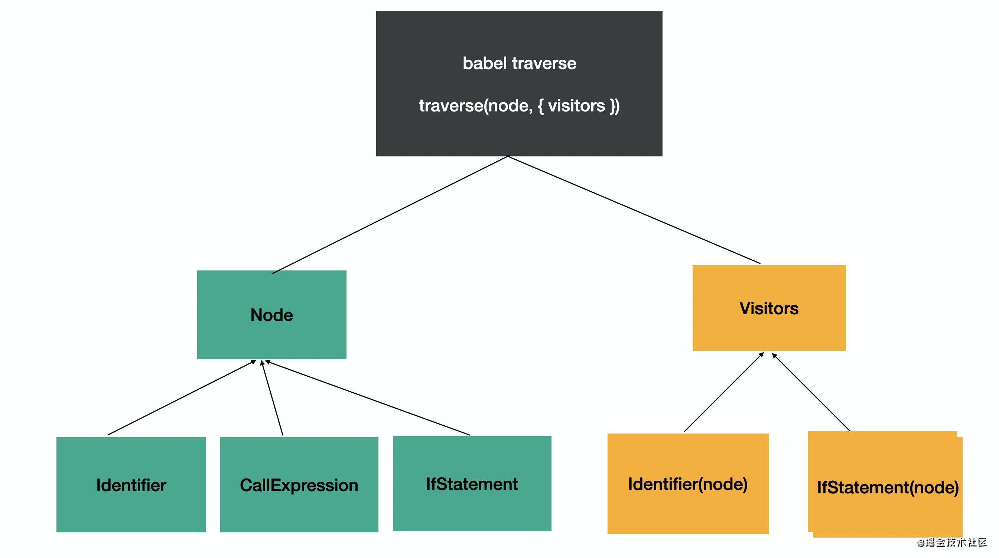
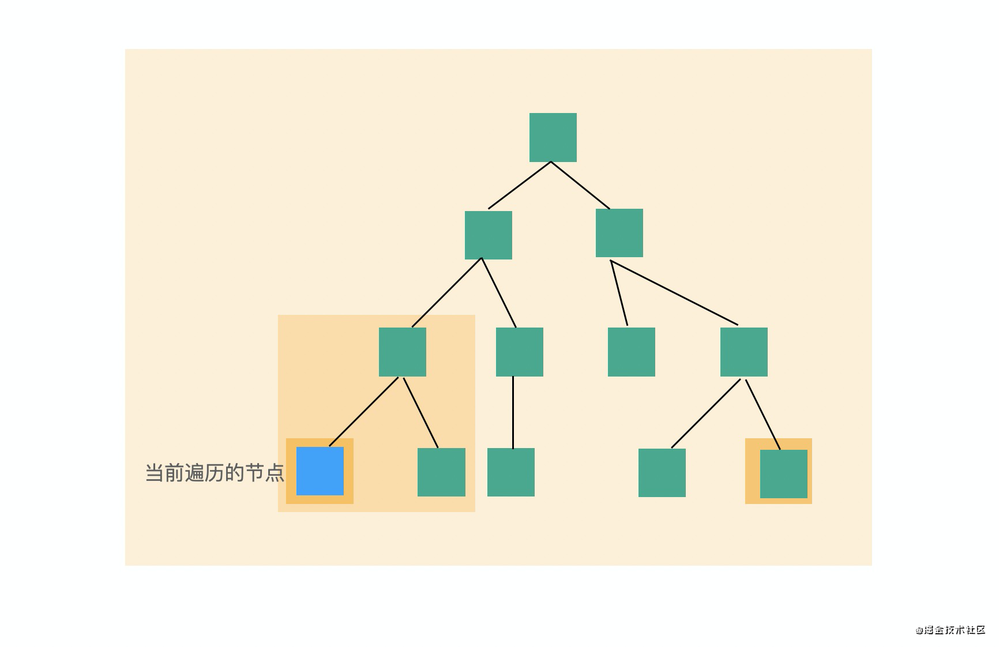
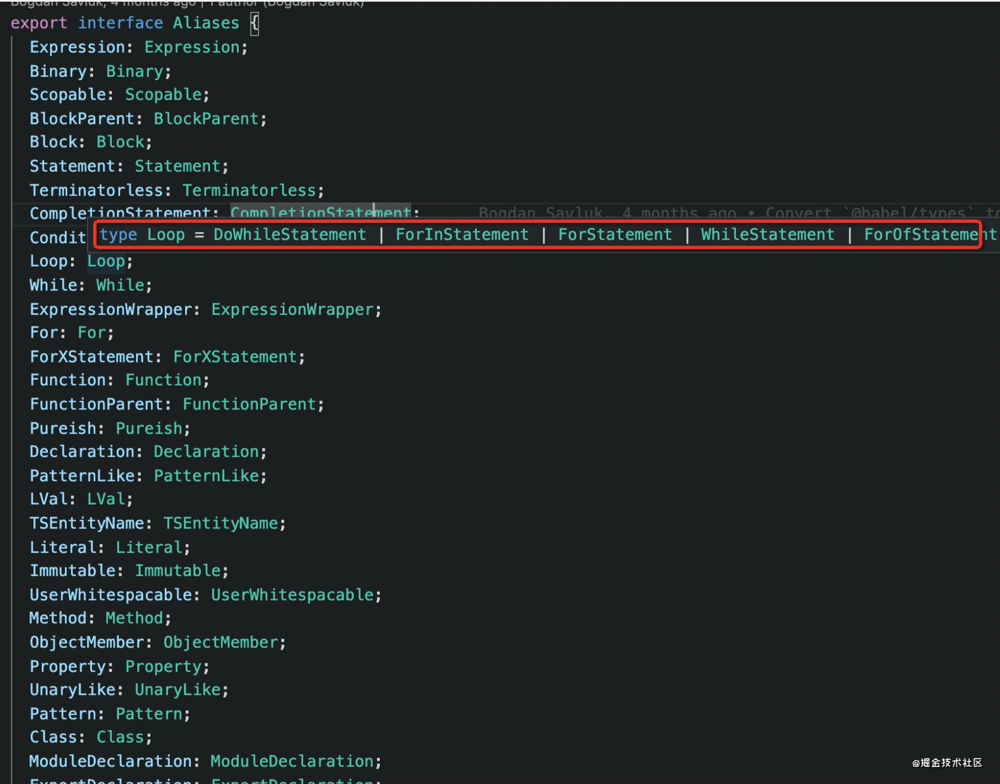

babel 会递归遍历 AST，遍历过程中处理到不同的 AST 会调用不同的 visitor 函数来实现 transform。这是 visitor 模式的应用。

# visitor模式
visitor 模式（访问者模式）是 23 种经典设计模式中的一种。当被操作的对象结构比较稳定，而操作对象的逻辑经常变化的时候，通过分离逻辑和对象结构，使得他们能独立扩展。这就是 visitor 模式的思想。

对应到 babel traverse 的实现，就是 AST 和 visitor 分离，在 traverse（遍历）AST 的时候，调用注册的 visitor 来对其进行处理。



这样使得 AST 的结构和遍历算法固定，visitor 可以通过插件独立扩展。

----------------------

# 路径和作用域(path,scope)

babel AST 中只包含源码的一些信息，但是操作 AST 时要拿到父节点的信息，并且也需要对 AST 增删改的方法，这些都在 path 对象里。

babel 会在 traverse 的过程中在 path 里维护节点的父节点引用，在其中保存 scope（作用域）的信息，同时也会提供增删改 AST 的方法。

```js
path {
    // 属性：
    node 
    parent
    parentPath
    scope
    hub
    container
    key
    listKey
    
    // 方法
    get(key) 
    set(key, node)
    inList()
    getSibling(key) 
    getNextSibling()
    getPrevSibling()
    getAllPrevSiblings()
    getAllNextSiblings()
    isXxx(opts)
    assertXxx(opts)
    
    insertBefore(nodes)
    insertAfter(nodes)
    replaceWith(replacement)
    replaceWithMultiple(nodes)
    replaceWithSourceString(replacement)
    remove()
    
    traverse(visitor, state)
    skip()
    stop()
}
```

它们各自的含义：  
- `path.node` 当前 AST 节点
- `path.parent` 父 AST 节点
- `path.parentPath` 父 AST 节点的 path
- `path.scope` 作用域，见下文详解
- `path.hub` 可以通过 path.hub.file 拿到最外层 File 对象， path.hub.getScope 拿到最外层作用域，path.hub.getCode 拿到源码字符串
- path.container 当前 AST 节点所在的父节点属性的属性值
- path.key 当前 AST 节点所在父节点属性的属性名或所在数组的下标
- path.listkey 当前 AST 节点所在父节点属性的属性值为数组时 listkey 为该属性名，否则为 undefined
 
container、listkey、key 这三个属性有点绕（也不太常用，可以跳过），解释一下：  
> 因为 AST 节点要挂在父 AST 节点的某个属性上，那个属性的属性值就是这个 AST 节点的 container。  
> 比如 CallExpression 有 callee 和 arguments 属性，那么对于 callee 的 AST 节点来说，callee 的属性值就是它的 container，而 callee 就是它的 key。

**path 有如下方法**  
- `inList()` 判断节点是否在数组中，如果 container 为数组，也就是有 listkey 的时候，返回 true
- `get(key)` 获取某个属性的 path
- `set(key, node)` 设置某个属性的值
- `getSibling(key)` 获取某个下标的兄弟节点
- `getNextSibling()` 获取下一个兄弟节点
- `getPrevSibling()` 获取上一个兄弟节点
- `getAllPrevSiblings()` 获取之前的所有兄弟节点
- `getAllNextSiblings()` 获取之后的所有兄弟节点
- `isXxx(opts)` 判断当前节点是否是某个类型，可以传入属性和属性值进一步判断，比如path.isIdentifier({name: 'a'})
- `assertXxx(opts)` 同 isXxx，但是不返回布尔值，而是抛出异常
- `insertBefore(nodes)` 在之前插入节点，可以是单个节点或者节点数组
- `insertAfter(nodes)` 在之后插入节点，可以是单个节点或者节点数组
- `replaceWith(replacement)` 用某个节点替换当前节点
- `replaceWithMultiple(nodes)` 用多个节点替换当前节点
- `replaceWithSourceString(replacement)` 解析源码成 AST，然后替换当前节点
- `remove()` 删除当前节点
- `traverse(visitor, state)` 遍历当前节点的子节点，传入 visitor 和 state（state 是不同节点间传递数据的方式）
- `skip()` 跳过当前节点的子节点的遍历
- `stop()` 结束所有遍历

## 作用域 path.scope
scope 是作用域信息，javascript 中能生成作用域的就是模块、函数、块等，而且作用域之间会形成嵌套关系，也就是作用域链。babel 在遍历的过程中会生成作用域链保存在 path.scope 中。

属性和方法大概有这些
```js
path.scope {
    bindings
    block
    parent
    parentBlock
    path
    references
 
    dump()
    parentBlock()
    getAllBindings()
    getBinding(name)
    hasBinding(name)
    getOwnBinding(name)
    parentHasBinding(name)
    removeBinding(name)
    moveBindingTo(name, scope)
    generateUid(name)
}
```

各自的含义：

- `scope.bindings` 当前作用域内声明的所有变量
- `scope.block` 生成作用域的 block，详见下文
- `scope.path` 生成作用域的节点对应的 path
- `scope.references` 所有 binding 的引用对应的 path，详见下文
- `scope.dump()` 打印作用域链的所有 binding 到控制台
- `scope.parentBlock()` 父级作用域的 block
- `getAllBindings()` 从当前作用域到根作用域的所有 binding 的合并
- `getBinding(name)` 查找某个 binding，从当前作用域一直查找到根作用域
- `getOwnBinding(name)` 从当前作用域查找 binding
- `parentHasBinding(name, noGlobals)` 查找某个 binding，从父作用域查到根作用域，不包括当前作用域。可以通过 noGlobals 参数指定是否算上全局变量（比如console，不需要声明就可用），默认是 false
- `removeBinding(name)` 删除某个 binding
- `hasBinding(name, noGlobals)` 从当前作用域查找 binding，可以指定是否算上全局变量，默认是 false
- `moveBindingTo(name, scope)` 把当前作用域中的某个 binding 移动到其他作用域
- `generateUid(name)` 生成作用域内唯一的名字，根据 name 添加下划线，比如 name 为 a，会尝试生成 _a，如果被占用就会生成 __a，直到生成没有被使用的名字

#### scope.block
能形成 scope 的有这些节点，这些节点也叫 block 节点。
```js
export type Scopable =
  | BlockStatement
  | CatchClause
  | DoWhileStatement
  | ForInStatement
  | ForStatement
  | FunctionDeclaration
  | FunctionExpression
  | Program
  | ObjectMethod
  | SwitchStatement
  | WhileStatement
  | ArrowFunctionExpression
  | ClassExpression
  | ClassDeclaration
  | ForOfStatement
  | ClassMethod
  | ClassPrivateMethod
  | StaticBlock
  | TSModuleBlock;
```

我们可以通过 `path.scope.block` 来拿到所在的块对应的节点，通过 `path.scope.parentBlock` 拿到父作用域对应的块节点。

#### scope.bindings、scope.references
作用域中保存的是声明的变量和对应的值，每一个声明叫做一个binding（绑定）。

const a = 1;的path.scope.bindings 是这样的：

```js
bindings: {
    a: {
        constant: true,
        constantViolations: [],
        identifier: {type: 'Identifier', ...}
        kind:'const',
        path: {node,...}
        referenced: false
        referencePaths: [],
        references: 0,
        scope: ...
    }
}
```

因为我们在当前 scope 中声明了 a 这个变量，所以 bindings 中有 a 的 binding，每一个 binding 都有 kind，这代表绑定的类型

- var、let、const 分别代表 var、let、const 形式声明的变量
- param 代表参数的声明
- module 代表 import 的变量的声明

binding 有多种 kind，代表不同的声明方式。

binding.identifier 和 binding.path，分别代表标识符的 AST、整个声明语句的 AST。

声明之后的变量会被引用和修改，binding.referenced 代表声明的变量是否被引用，binding.constant 代表变量是否被修改过。如果被引用了，就可以通过 binding.referencePaths 拿到所有引用的语句的 path。如果被修改了，可以通过 binding.constViolations 拿到所有修改的语句的 path。

path 的 api 还是比较多的，这也是 babel 最强大的地方。主要是操作当前节点、当前节点的父节点、兄弟节点，作用域，以及增删改的方法。

### node 链、block 链、scope 链
从某一个节点出发有 3 条链，path 和 path.parent 串联起来的 AST node 链，path.scope 和 path.scope.parent 串联起来的作用域 scope 链，path.scope.block 和 path.scope.parentBlock 串联起来的块 AST block 链。



注意，这三条链只是从某个节点出发到父节点的路径，整个 AST 中的路径不止一条，整体来看就是 ast 树、scope 树、block 树，不过我们写插件一般`只用到某一条路径`。

----------------------
# state
state 是遍历过程中 AST 节点之间传递数据的方式，插件的 visitor 中，第一个参数是 path，第二个参数就是 state。插件可以从 state 中拿到 opts，也就是插件的配置项，也可以拿到 file 对象，file 中有一些文件级别的信息，这个也可以从 path.hub.file 中拿。
```
state {
    file
    opts
}
```
可以在遍历的过程中在 state 中存一些状态信息，用于后续的 AST 处理。不是遍历过程中的数据，可以通过 file.set、file.get 来保存。

# AST 的别名
遍历的时候要指定 visitor 处理的 AST，有的时候需要对多个节点做同样的处理，babel 支持指定多个 AST 类型，也可以通过别名指定一系列类型。
```js
  // 单个 AST 类型
  FunctionDeclaration(path, state) {},
  // 多个 AST 类型
  'FunctionDeclaration|VariableDeclaration'(path, state) {}
  // AST 类型别名
  Declaration(){}
```

可以在[文档](https://babeljs.io/docs/en/babel-types)中查到某个 AST 类型的别名是啥，某个别名都包含哪些 AST 类型可以在[babel-types的类型](https://github.com/babel/babel/blob/main/packages/babel-types/src/ast-types/generated/index.ts#L2489-L2535)定义处查。

建议把 @babel/types 源码下载下来看，类型定义在 src/ast-types/generated 目录下，这样可以利用 ide 的功能方便的查看每种 alias 的具体 AST 类型。




所有的 AST 相关的信息都可以在babel-types里查看，每一个 AST 节点怎么创建、怎么校验、怎么遍历，其实都与 AST 的结构有关系，这些都在 babel-types 里面定义。

比如if就定义了有哪些属性可以遍历、别名是什么，每一个属性怎么校验，然后会根据这些规则生成xxx，isXxx，assertXxx等api用于创建、判断AST节点。