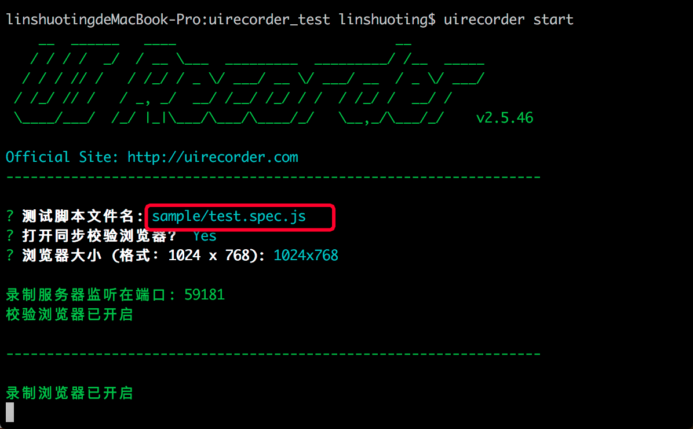
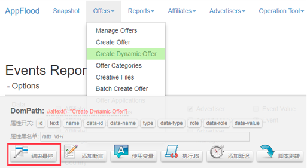
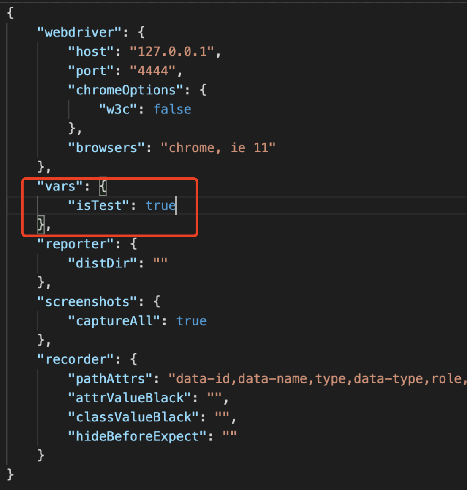
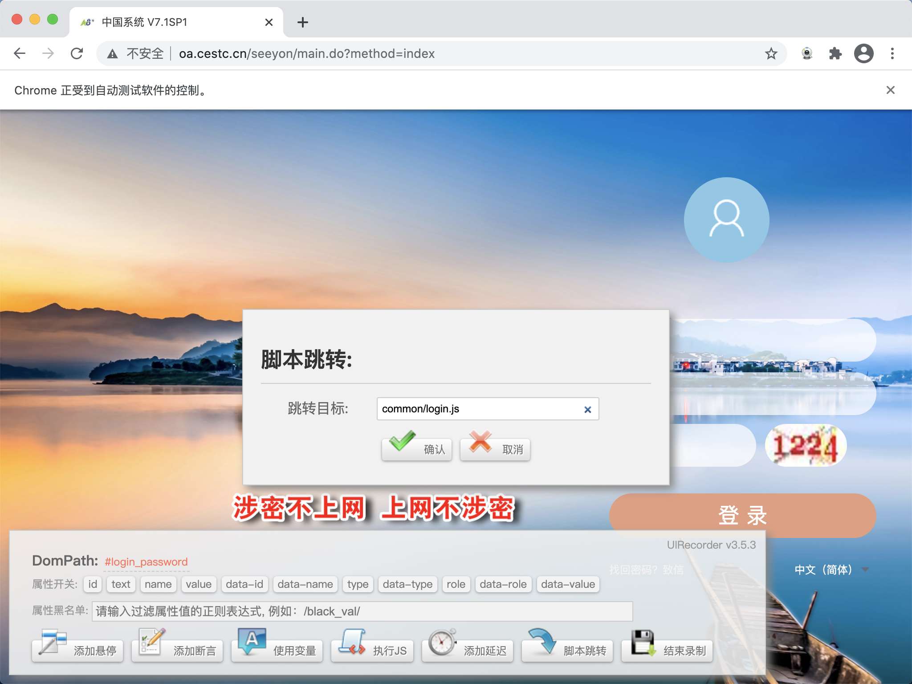
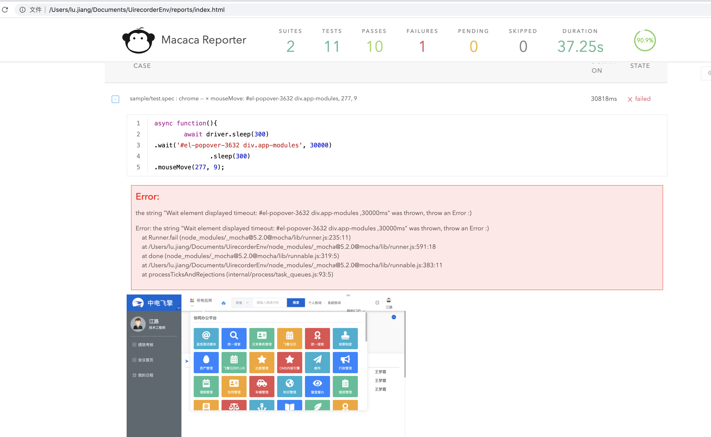

# uirecorder
## 概述
UIRecorder 是一款 `UI录制` 和 `回归测试` 工具，用于录制浏览器页面 UI 的操作。通过 UIRecorder 的录制功能，可以在自测的同时，完成测试过程的录制，生成 JavaScript 测试脚本代码。回归测试过程中，可以利用生成的 JavaScript 测试脚本代码，使用 `Mocha` 对自测过程进行回放，以达到零成本做自动化回归测试的目的

## 优点
- 零成本的自动化解决方案：完全无干扰录制，让开发在自测过程中就能同步录制出自动化。
- 测试报告直观：测试结果会生产 HTML 格式的报告文件，且每一个核心步骤都会自动截图，便于通过截图直观地分析报错原因。
- 测试多浏览器兼容性：通过 Chrome 浏览器一端录制生成的测试用例脚本，可以在 Firefox、IE、Opera 等浏览器多端运行回归测试

## 环境搭建
> 安装nodejs： MAC 12.x及以上  
安装chrome：MAC &emsp;/Applications  
&emsp;&emsp;&emsp;&emsp;&emsp;&emsp;&nbsp;Windows用户必须安装在 <font color="green">C:\Program Files (x86)\Google\Chrome\Application</font>

使用淘宝源安装NPM
1. 安装cnpm
> npm install -g cnpm --registry=https://registry.npm.taobao.org
2. 安装uirecorder
> cnpm install uirecorder mocha macaca-reporter -g

使用下列命令检查uirecorder是否完成安装
```
cnpm list uirecorder -g
cnpm list mocha -g
cnpm list macaca-reporter -g
```

## 录制脚本
### 一、初始化
> uirecorder init
执行之后一路回车&emsp;// 配置可后续通过config.json重新配置

### 二、开始录制
> uirecorder start


一个脚本文件对应一个录制的测试用例，新建测试用例注意脚本文件名不要跟已有文件名冲突

hosts 配置 `127.0.0.1 localhost`。进入页面输入 url 则可以开始录制。默认会打开同步校验浏览器，该浏览器的作用是在录制的同时做回归测试校验，如果提示执行失败，则说明回归测试过程很大几率也会执行失败，需要对录制过程进行优化（比如借助工具栏辅助功能）

已有测试用例继续录制，运行以下命令，待页面加载执行完毕，可继续录制：
> uirecorder sample/test.spec.js  // 对应文件名

录制完成点击结束录制，将保存至设定文件中

### 三、已有工程安装
比如直接从 git 仓库 clone 的已有测试工程，可通过以下步骤安装依赖：
```
// 安装node依赖包
npm install
// 安装 standalone-selenium 依赖 webdriver
npm run installdriver
```

### 四、谷歌调试台移动端
如果需要在 chrome 浏览器移动设备模拟器模式下录制，可以修改 `config.json` 文件如下。且配置完 `config.json` 文件，回归场景也是模拟器模式进行回归。

```json
{
    "webdriver": {
        "host": "127.0.0.1",
        "port": "4444",
        "browsers": "chrome",
        "chromeOptions": {
            "args": ["--enable-automation", "--incognito"],
            "mobileEmulation": {
                "deviceName": "iPhone 6"
            }
        }
    },
    "vars": {},
    "recorder": {
        "pathAttrs": "data-id,data-name,type,data-type,role,data-role,data-value",
        "attrValueBlack": "",
        "classValueBlack": "",
        "hideBeforeExpect": ""
    }
}
```

其中， `mobileEmulation` 字段指定设备型号，可选型号可参考以下列表:
```
BlackBerry Z30
Blackberry PlayBook
Galaxy Note 3
Galaxy Note II
Galaxy S III
Kindle Fire HDX
LG Optimus L70
Laptop with HiDPI screen
Laptop with MDPI screen
Laptop with touch
Microsoft Lumia 550
Microsoft Lumia 950
Nexus 10
Nexus 4
Nexus 5
Nexus 6
Nexus 7
Nokia Lumia 520
Nokia N9
iPad Mini
iPhone 4
Galaxy S5
Nexus 5X
Nexus 6P
iPhone 5
iPhone 6
iPhone 6 Plus
iPad
```

# uirecorder的添加悬停
当页面中存在二级目录等类似情况时，需要鼠标悬停操作，UIRecorder 就提供了添加悬停操作，可单次悬停或多次添加悬停。依据需求可自行选择实现方式。效果如图：

- 单次悬停：点击`“添加悬停”`按钮，鼠标变为绿色锁定元素，单击后结束悬停。
- 多次添加悬停：按住 `command` 键（Windows ctrl 键），点击添加悬停按钮，进入悬停模式，可释放 `command` 键，点击需要悬停的 DOM 控件，添加完成后，按下 esc 键或点击“结束悬停”按钮，退出悬停模式。

# uirecorder的断言
## 断言类型
1. val：输入框的值
2. text：文本的内容
3. displayed：控件是否处于显示状态
4. enabled：当前控件是否可用（没有禁用)
5. selected：当前控件是否打勾选中了
6. attr：当前DOM的属性值
7. css：当前DOM的CSS值
8. url：当前网页的URL地址
9. title：当前网页的title标题
10. cookie：当前网页的cookie值
11. localStorage：当前网页的localStorage
12. sessionStorage：当前网页的sessionStorage
13. alert：弹出的alert窗口的提示文本
14. jscode：浏览器端执行自定义的JS代码，断言JS代码的返回值
15. count：控件匹配的数量
16. imgdiff：当前控件的图片差异，可以自定义图片差异的百分比

## 比较方式
1. equal：相等
2. notEqual：不相等
3. contain：包含，目标值包含另外一个值
4. notContain：不包含
5. above：大于，用于断言数值大于某个值
6. below：小于，用于断言数值小于某个值
7. match：匹配正则，一般用于高级断言，例如：/aaa\d+bbb/
8. notMatch：不匹配正则

# uirecorder使用变量
添加变量有 2 种方式。一种方式是在 config.json 文件中直接编辑添加；另一种方式是在录制页面，点击使用变量，选择创建变量。其中，所有变量字符串均支持 js 语法的模版字符串，如：{{productName}} ${new Date().getTime()} 。  

## **编辑config.js**

## **录制页面创建变量**
点击工具栏“使用变量”按钮，点击页面对应 DOM 节点，弹出弹窗，输入信息。

# uirecorder执行js
可以写jquery语法  
`$('#id').value = 'xxx'`

# uirecorder的模块化（脚本跳转）
录制过程中，可录制一些公用脚本，例如：登录脚本( `common/test.login.js` )、固定流程等。调用公共脚本的方法：在开始页面的时候输入 `common/test.login.js`，或者在录制中间页面时，点击脚本跳转，脚本跳转弹窗中输入 `common/test.login.js`。当 `common/test.login.js` 加载完成后，继续下面的录制步骤，效果如下：

这里的这点需要说明下，就是如果录制了比如登录这种共用的方法库，那么需要将脚本从 `sample`复制到 `common`目录下，当做公共的方法去调用使用

# uirecorder上传文件
只要页面上传按钮的 `role` 属性或 `data-role` 标注为 `upload` ，则可以录制成功。需要注意的是，上传的文件必须保存在当前工程目录的 `/uploadfiles/` 文件夹中，且 `UIRecorder` 仅支持 `native` 文件上传，不支持 Flash 上传

# 启动WebDriver服务
- cnpm install selenium-standalone@latest -g   #安装selenium-standalone
- selenium-standalone install  #安装selenium-standalone依赖
- selenium-standalone start  #启动selenium-standalone
- mocha sample/test.spec.js   #新开终端使用mocha回放（失败）
- uirecorder start sample/test.spec.js    #使用uirecorder回放并继续录制（成功）

# 回放并生成报告
在uirecorder目录下执行
```
npm run moduletest sample/test.spec.js
```
最终在目录下生成report目录
,点击内部html


# 注意
注意脚本的命名格式和保存的路径必须是*/**.spec.js