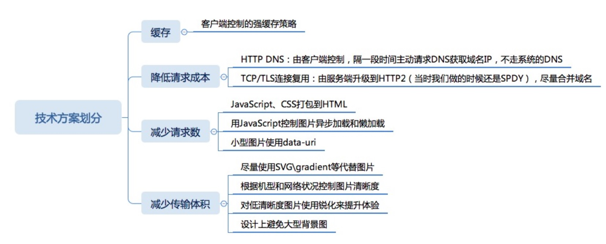

## DOM树：
标签语义化  
避免深层嵌套

转换：浏览器从磁盘或网络读取HTML的原始字节，然后根据指定的文件编码格式（例如 UTF-8）将其转换为相应字符

令牌化：浏览器把字符转化成W3C HTML5 标准指定的各种确切的令牌，比如"<html>"、"<body>"以及其他在尖括号内的字符串。每个令牌都有特殊的含义以及它自己的一套规则

词法分析：生成的令牌转化为对象，这个对象定义了它们的属性及规则

DOM构建：最后，由于HTML标记定义了不同标签之间的关系（某些标签嵌套在其他标签中），创建的对象在树状的数据结构中互相链接，树状数据结构也捕获了原始标签定义的父子关系：HTML对象是body对象的父对象，body是p对象的父对象等等


## CSSOM树
减少选择器层级  less层级嵌套要慎用  
优先请求css，利用http多请求多并发机制：应该减少@import的方式导入css => 同步的，阻塞。  link异步的不阻塞，放头部先于DOM树请求。

总结步骤：
- 生成DOM树
- 生成CSSOM树
- 融合DOM与CSSOM树生成渲染树
- 回流 ：少操作DOM（vue或react做了）
- 重绘

## js
放尾部，开启defer或async，推荐defer

## DNS解析
减少DNS请求次数：但做负载均衡，服务器分离部署，服务器是增加的，很难优化  
DNS预获取： \<link rel="dns-prefetch" href="DNS地址">放本地缓存  


## preload
preload 提供了一种声明式的命令，让浏览器提前加载指定资源(加载后并不执行)，需要执行时再执行
这样做的好处在于：
  1、将加载和执行分离开，不阻塞渲染和document的onload事件
  2、提前加载指定资源，不再出现依赖的font字体隔了一段时间才刷出的情况

as  控制优先级
Preload 的与众不同还体现在 onload 事件上。也就是说可以定义资源加载完毕后的回调函数
```<link rel="preload" href="..." as="..." onload="preloadFinished()">```

　　比如，可以使用preload的样式表立即生效
```<link rel="preload" href="style.css" onload="this.rel=stylesheet">```

　　此外，preload 不会阻塞 windows 的 onload 事件
　　对跨域的文件进行preload时，必须加上 crossorigin 属性
```<link rel="preload" as="font" crossorigin href="https://at.alicdn.com/t/font_zck90zmlh7hf47vi.woff">```

## prefetch
  ```<link rel=“prefetch”>```
　它的作用是告诉浏览器加载下一页面可能会用到的资源，注意，是下一页面，而不是当前页面。因此该方法的加载优先级非常低，也就是说该方式的作用是加速下一个页面的加载速度

## 从输入URL后按下回车技术方案
