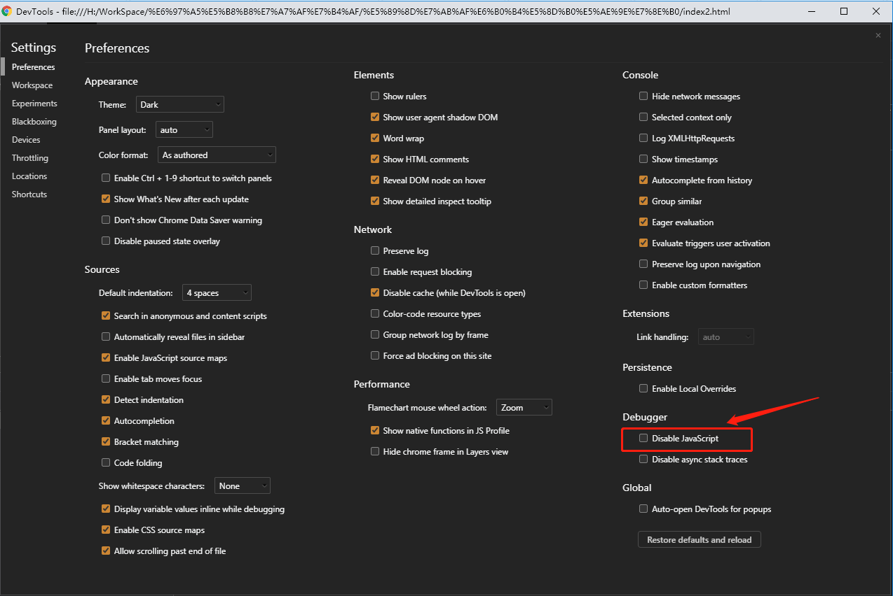

# 明水印
类似PS的图层概念。网页也是如此。我们可以通过绝对定位，来将水印覆盖到我们的页面之上。

直接覆盖上去，就好像是一个蒙层，我都知道这样是无法触发底下图层的事件的，此时就要介绍一个css属性`pointer-events`。

> `pointer-events` CSS 属性指定在什么情况下 (如果有) 某个特定的图形元素可以成为鼠标事件的 `target`

当它的被设置为 `none` 的时候，能让元素实体虚化，虽然存在这个元素，但是该元素不会触发鼠标事件。详情可以查看 <font color="pink">CSS3 pointer-events:none应用举例及扩展 « 张鑫旭-鑫空间-鑫生活</font>

## 明水印的生成
明水印的生成方式主要可以归为两类，一种是 纯 html 元素(纯div)，另一种则为背景图（canvas/svg）。

#### div实现
见index1.html

#### canvas实现
见index2.html

## 明水印的破解
直接删除生成的水印html

## 明水印的防御
js 有一个方法叫做 `MutationObserver`，能够监控元素的改动.  
MutationObserver是元素观察器，字面上就可以理解这是用来观察Node（节点）变化的。

在这里我们主要观察的有三点
- 水印元素本身是否被移除
- 水印元素属性是否被篡改（display: none ...）
- 水印元素的子元素是否被移除和篡改 （element生成的方式 ）
来通过 MDN 查看该方法的使用示例。

```js
const targetNode = document.getElementById('some-id');

// 观察器的配置（需要观察什么变动）
const config = { attributes: true, childList: true, subtree: true };

// 当观察到变动时执行的回调函数
const callback = function(mutationsList, observer) {
    // Use traditional 'for loops' for IE 11
    for(let mutation of mutationsList) {
        if (mutation.type === 'childList') {
            console.log('A child node has been added or removed.');
        }
        else if (mutation.type === 'attributes') {
            console.log('The ' + mutation.attributeName + ' attribute was modified.');
        }
    }
};

// 创建一个观察器实例并传入回调函数
const observer = new MutationObserver(callback);

// 以上述配置开始观察目标节点
observer.observe(targetNode, config);
```

而MutationObserver主要是监听子元素的改动，因此我们的监听对象为 document.body, 一旦监听到我们的水印元素被删除，或者属性修改，我们就重新生成一个。通过以上示例，加上我们的思路，很快我们就写一个监听删除元素的示例。（监听属性修改也是类似就不一一展示了）

```js
// 观察器的配置（需要观察什么变动）
const config = { attributes: true, childList: true, subtree: true };
// 当观察到变动时执行的回调函数
const callback = function (mutationsList, observer) {
// Use traditional 'for loops' for IE 11
  for (let mutation of mutationsList) {
    mutation.removedNodes.forEach(function (item) {
      if (item === watermakr) {
       document.body.appendChild(watermakr);
      }
    });
  }
};
// 监听元素
const targetNode = document.body;
// 创建一个观察器实例并传入回调函数
const observer = new MutationObserver(callback);
// 以上述配置开始观察目标节点
observer.observe(targetNode, config);
```

## 明水印只针对开发小白，测试都能F12了，挡不住测试
**明水印的破解1：**
打开`Chrome Devtools`，点击设置 - Debugger - Disabled JavaScript .

然后再打开页面，delete我们的水印元素。

**明水印的破解2：**
复制一个 body 元素，然后将原来 body 元素的删除。

**明水印的破解3：**
打开一个代理工具，例如 `charles`，将生成水印相关的代码删除。


# 暗水印
> 暗水印是一种肉眼不可见的水印方式，可以保持图片美观的同时，保护你的资源版权。
暗水印的生成方式有很多，常见的为通过修改RGB 分量值的小量变动、DWT、DCT 和 FFT 等等方法。  
我们都知道图片都是有一个个像素点构成的，每个像素点都是由 RGB 三种元素构成。当我们把其中的一个分量修改，人的肉眼是很难看出其中的变化，甚至是像素眼的设计师也很难分辨出。

例如 rgb(41,88,172)   rgb(42,88,172)

#### 解码过程
首先创建一个 `canvas` 标签。
```html
<canvas id="canvas" width="256" height="256"></canvas>
```
canvas的getImageData方法

边框背景色取头像像素点的均值
```js
var ctx = document.getElementById('canvas').getContext('2d');
var img = new Image();
var originalData;
img.onload = function () {
  // canvas像素信息
  ctx.drawImage(img, 0, 0);
  originalData = ctx.getImageData(0, 0, ctx.canvas.width, ctx.canvas.height);
  console.log()
  processData(ctx, originalData)
};
img.src = 'qiufeng-super.png';
```
我们打印出这个数组，会有一个非常大的数组，一共有 256 * 256 * 4 = 262144 个值。因为每个像素除了 RGB 外还有一个 alpha 通道，也就是我们常用的透明度。

我们的 R 通道为奇数的时候 ，就我们的解密密码。因此我们只需要所有的像素点的 R 通道为奇数的时候，将它填填充，不为奇数的时候就不填充，很快我们就能得到我们的隐藏图像。

```js
var processData = function (ctx, originalData) {
    var data = originalData.data;
    for (var i = 0; i < data.length; i++) {
        if (i % 4 == 0) {
            // R分量
            if (data[i] % 2 == 0) {
                data[i] = 0;
            } else {
                data[i] = 255;
            }
        } else if (i % 4 == 3) {
            // alpha通道不做处理
            continue;
        } else {
            // 关闭其他分量，不关闭也不影响答案
            data[i] = 0;
        }
    }
    // 将结果绘制到画布
    ctx.putImageData(originalData, 0, 0);
}
processData(ctx, originalData)
```
#### 编码过程
首先获取加密的图像信息。
```js
var textData;
var ctx = document.getElementById('canvas').getContext('2d');
ctx.font = '30px Microsoft Yahei';
ctx.fillText('ded', 60, 130);
textData = ctx.getImageData(0, 0, ctx.canvas.width, ctx.canvas.height).data;
```
然后提取加密信息在待加密的图片上进行处理。
```js
var mergeData = function (ctx, newData, color, originalData) {
    var oData = originalData.data;
    var bit, offset;  // offset的作用是找到alpha通道值，这里需要大家自己动动脑筋

    switch (color) {
        case 'R':
            bit = 0;
            offset = 3;
            break;
        case 'G':
            bit = 1;
            offset = 2;
            break;
        case 'B':
            bit = 2;
            offset = 1;
            break;
    }

    for (var i = 0; i < oData.length; i++) {
        if (i % 4 == bit) {
            // 只处理目标通道
            if (newData[i + offset] === 0 && (oData[i] % 2 === 1)) {
                // 没有信息的像素，该通道最低位置0，但不要越界
                if (oData[i] === 255) {
                    oData[i]--;
                } else {
                    oData[i]++;
                }
            } else if (newData[i + offset] !== 0 && (oData[i] % 2 === 0)) {
                // // 有信息的像素，该通道最低位置1，可以想想上面的斑点效果是怎么实现的
                oData[i]++;
            }
        }
    }
    ctx.putImageData(originalData, 0, 0);
}
```
在有像素信息的点，将 R 偶数的通道+1。在没有像素点的地方将 R 通道转化成偶数，最后在 img.onload 调用 processData(ctx, originalData) 。
```js
img.onload = function () {
  // 获取指定区域的canvas像素信息
  ctx.drawImage(img, 0, 0);
  originalData = ctx.getImageData(0, 0, ctx.canvas.width, ctx.canvas.height);
  console.log(originalData)
  processData(ctx, originalData)
};
```

但是实际过程需要更专业的加密方式，例如利用傅里叶变化公式，来进行频域制定数字盲水印